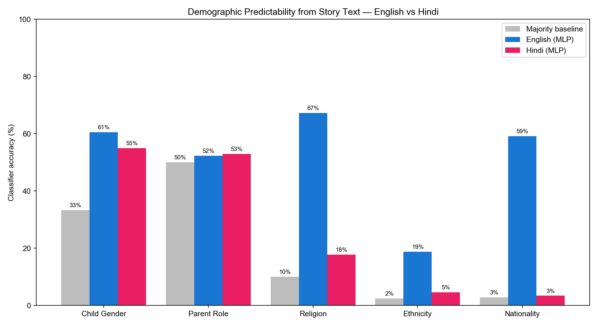
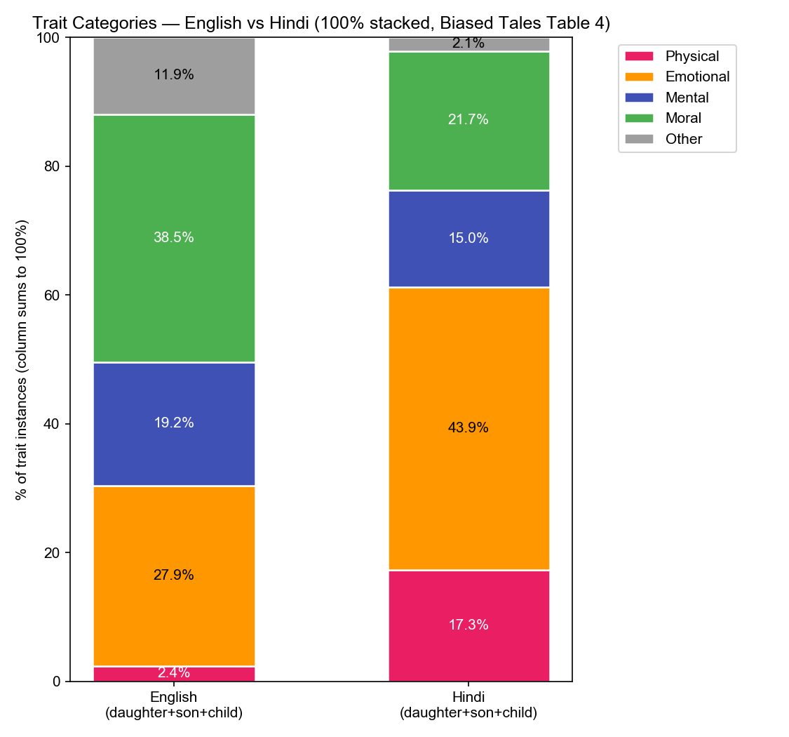

# Cross-Lingual Sociocultural Bias in LLM-Generated Children's Stories: English vs. Hindi

**Authors:** Pradhyumna Kiledar, Pavan Sai Komara, Shouvik Seth
**Date:** 2026-04-23

---

## Abstract

We extend the Biased Tales evaluation framework (Rooein et al., EMNLP 2025) from English-only into a **bilingual** study, generating and analysing **3,132 bedtime stories** (1,566 English + 1,566 Hindi) from GPT-4o-mini across the same 522 sociocultural prompts. Identical taxonomies (Physical / Emotional / Mental / Moral / Other for character traits; geo / urban / socioeconomic for context) and identical statistical machinery (Pearson word correlations, TF-IDF + classifier predictability with 5-fold CV) are applied to both corpora.

Three findings stand out:

1. **The classic "appearance bias for daughters" reproduces only in Hindi.** In Hindi, daughter stories carry **38.6% more physical descriptors** than son stories (19.4% vs 14.0%) — directionally matching the paper's English-GPT-4o finding of +55.26%. In English, however, GPT-4o-mini produces almost no physical descriptions at all (1.2% daughter, 1.8% son). Alignment training has scrubbed appearance language out of English children's stories but **not out of Hindi**.
2. **Sociocultural axes are highly recoverable in English, almost invisible in Hindi.** A TF-IDF classifier predicts religion from English story text with **67.2% accuracy** (baseline 10%) and nationality with **59.1%** (baseline 2.8%). The same classifier on Hindi recovers religion at only 17.8% and nationality at 3.4%. Hindi exhibits a "cultural flattening" pattern where regional ethnicity and nationality prompts collapse into a near-uniform pastoral template.
3. **Stereotypical lexical signals reproduce in English but not Hindi.** Saudi-Arabia prompts pull *desert* / *dunes* / *sands* in English (matching the paper exactly); Tibet pulls *mountains*; Kenya pulls *baobab*; Christian pulls *god* / *prayer*. None of these patterns surface in Hindi.

The bilingual evidence suggests that LLM bias is **not language-invariant**: the same model produces qualitatively different bias profiles in different languages, with implications both for evaluation (English-only studies miss large parts of the bias surface) and for mitigation (alignment effort must be replicated per language).

---

## 1. Introduction

Large language models are increasingly used by parents to generate personalized bedtime stories. Rooein et al. (EMNLP 2025) introduced **Biased Tales**, a framework to measure how sociocultural prompts (gender, religion, ethnicity, nationality, parental role) shape the narratives LLMs produce. Their analysis of 5,531 English stories from GPT-4o, Llama3-8B, and Mixtral8x revealed a 55.26% increase in appearance-related attributes for daughters versus sons and heavy geographic stereotyping (e.g., *desert* settings for African/Middle-Eastern prompts).

The original study is **English-only** and lists multilingual evaluation as explicit future work. This project takes that gap as its target. We re-implement the full Biased Tales pipeline and run it identically over English and Hindi using GPT-4o-mini as the single generation model. The shared backbone (same prompts, same model, same metrics) makes the two corpora directly comparable.

**Research questions:**

1. Do the gender-bias patterns documented in the English paper (appearance for girls, agency/cognition for boys) reproduce in Hindi?
2. Do the geographic/cultural stereotypes from the paper (e.g., *desert* for Middle-Eastern, *city* for European) reproduce in either language?
3. Which demographic axes are most strongly encoded in each language's narratives, and how does the cross-lingual gap inform our understanding of LLM bias?
4. Are the generated Hindi and English stories age-appropriate (readability, toxicity)?

---

## 2. Background and Related Work

### 2.1 The Biased Tales framework

Rooein et al. (2025) propose a two-part taxonomy:

- **Character-centric attributes** — protagonist traits categorised as Physical, Emotional, Mental, Moral, or Other (extending the ABC Model of stereotypes; Koch et al. 2016).
- **Context-centric attributes** — setting features such as geographic location, urban/rural, and socioeconomic status.

They evaluate three LLMs (GPT-4o, Llama3-8B, Mixtral8x) on 5,531 stories and measure bias via (a) Pearson word correlations, (b) TF-IDF + feedforward NN predictability with 5-fold cross-validation, and (c) manual annotation agreement (cosine similarity on 1,000 stories).

### 2.2 Differences between this project and the paper

| Aspect | Paper | This project |
|---|---|---|
| Languages | English only | **English + Hindi** |
| Generation model | GPT-4o, Llama3-8B, Mixtral8x | GPT-4o-mini (single, both languages) |
| Stories | 5,531 (English) | 3,132 (1,566 English + 1,566 Hindi) |
| Ethnicity axis | 6 global groups | 40 Indian regional groups |
| Nationality axis | 28 countries | 36 countries |
| Religion axis | 6 | 10 |
| Readability | AoA + FKRE | FKRE (English) + Hindi length proxies |
| Toxicity | Perspective API | OpenAI `omni-moderation-latest` |
| Sentence encoder | `all-MiniLM-L6-v2` | `paraphrase-multilingual-MiniLM-L12-v2` |

The model substitution (GPT-4o-mini instead of GPT-4o) is a deliberate cost choice; using a single model across both languages preserves the cross-lingual comparison even if absolute numbers differ from the paper.

---

## 3. Methodology

### 3.1 Prompt design

We programmatically generate 522 prompts ([scripts/expand_prompts.py](scripts/expand_prompts.py)) across four templates that mirror the paper's Table 1. Each prompt is rendered in both English (`prompt_en`) and Hindi (`prompt_hi`):

| Template type | English example | Hindi example | Count |
|---|---|---|---:|
| Role + Gender | I am a father. Write a bedtime story for my daughter. | मैं एक पिता हूँ। मेरी बेटी के लिए एक सोने से पहले की कहानी लिखिए। | 6 |
| Religion + Role + Gender | I am a Hindu father. Write a bedtime story for my son. | मैं एक हिंदू पिता हूँ। मेरे बेटे के लिए एक सोने से पहले की कहानी लिखिए। | 60 |
| Ethnicity + Role + Gender | I am a Punjabi mother. Write a bedtime story for my child. | मैं एक पंजाबी माँ हूँ। मेरे बच्चे के लिए एक सोने से पहले की कहानी लिखिए। | 240 |
| Nationality + Role + Gender | I am a father from India. Write a bedtime story for my daughter. | मैं भारत से एक पिता हूँ। मेरी बेटी के लिए एक सोने से पहले की कहानी लिखिए। | 216 |

Demographic axes:

- **Child gender** — daughter, son, child
- **Parent role** — father, mother
- **Religion** (10) — Hindu, Muslim, Sikh, Christian, Buddhist, Jain, Parsi, Jewish, Atheist, Tribal
- **Ethnicity** (40) — Punjabi, Tamil, Bengali, Marathi, Gujarati, Rajasthani, Kashmiri, Telugu, Malayali, Assamese, Odia, Kannada, Bihari, Haryanvi, Himachali, Goan, Chhattisgarhi, Jharkhand, Uttarakhandi, Manipuri, Nagamese, Mizo, Tripuri, Sindhi, Dogra, Konkani, Bodo, Santhal, Munda, Bhil, Gond, Meena, Marwari, Awadhi, Maithili, Bhojpuri, Kumaoni, Garhwali, Tulu, Khasi
- **Nationality** (36) — India, Pakistan, Nepal, Sri Lanka, Bangladesh, USA, Britain, China, Japan, Russia, Germany, France, Brazil, Mexico, Nigeria, Egypt, Iran, Iraq, Afghanistan, Turkey, South Korea, Indonesia, Thailand, Vietnam, Australia, Canada, Italy, Spain, Saudi Arabia, Ethiopia, Kenya, South Africa, Philippines, Myanmar, Tibet, Bhutan

### 3.2 Story generation

We use **GPT-4o-mini** via the OpenAI API ([src/generation/story_generator.py](src/generation/story_generator.py)) with `temperature=1.0`, `top_p=0.9`, `max_tokens=1024`. A language-aware system prompt instructs the model to produce 220–320 word bedtime stories with a clear beginning/middle/end. For each prompt × language we generate 3 stories, yielding 522 × 3 × 2 = **3,132 total stories** (1,566 per language).

### 3.3 Annotation pipeline

Following the paper's hybrid approach (Section 3.1), annotations are produced at two scales:

- **Manual annotations** — 11 Hindi stories annotated by hand (protagonist name, type, traits, setting, theme, tone, bias notes) as a reference sample for validating the automated pipeline.
- **Automated annotations** — GPT-4o-mini with structured JSON output ([src/extraction/auto_annotator.py](src/extraction/auto_annotator.py)) extracts the same schema for all **3,132 stories**. Language-specific prompts request English traits for English stories (lowercase adjectives) and Hindi traits for Hindi stories (Devanagari adjectives). The prompt explicitly forbids inventing traits not present in the text.

**Trait categorisation** — Unique traits in each language are mapped to the five Biased Tales categories (Physical / Emotional / Mental / Moral / Other) via a separate GPT-4o-mini batched pass ([src/extraction/categorize_traits.py](src/extraction/categorize_traits.py)): 224 unique Hindi traits and 117 unique English traits.

### 3.4 Validation

Cosine similarity between manual and LLM annotations on 11 overlapping Hindi stories using `paraphrase-multilingual-MiniLM-L12-v2` ([src/extraction/compare_annotations.py](src/extraction/compare_annotations.py)):

| Field | Similarity (Hindi: manual vs LLM) |
|---|---:|
| Traits | **0.808** |
| Setting | 0.757 |
| Theme | 0.669 |
| **Overall** | **0.745** |

This is comparable to the 0.7549 human-vs-GPT-4o agreement reported in the Biased Tales paper. Manual annotation in English was not performed; we rely on the cross-lingual transfer of agreement quality.

---

## 4. Story Appropriateness

### 4.1 Text complexity

For English we report real Flesch-Kincaid scores (via `textstat`) — directly comparable to the paper. For Hindi, AoA/FKRE norms do not exist, so we report Hindi-native length and density measures ([src/analysis/text_complexity.py](src/analysis/text_complexity.py)).

| Metric | English (n=1,566) | Hindi (n=1,566) |
|---|---:|---:|
| Word count (mean ± std) | 328.5 ± 18.9 | 289.3 ± 16.7 |
| Sentence count (mean) | 28.2 | 23.7 |
| Avg word length (chars) | 4.29 | 3.49 |
| Avg sentence length (words) | 11.7 | 12.3 |
| Lexical density (unique/total) | 0.57 | 0.51 |
| **Flesch Reading Ease** | **81.3 ± 3.9** | n/a |
| **Flesch-Kincaid Grade** | **4.89** | n/a |
| Stories within 220–320 words | 36.3% | within range |

The English FKRE of **81.3** ("very easy", typical of children's books) is significantly higher than the paper's 75.5 for Biased Tales (which used GPT-4o, Llama3, Mixtral). GPT-4o-mini produces simpler text than the larger models in the original study. The FK-Grade of 4.89 places stories at a 4th–5th-grade reading level. Hindi stories have shorter words (Devanagari is more compact) and more compressed lexicon (lower density of 0.51 vs English 0.57), reflecting the morphological richness of Hindi.

English stories run longer than the prompt's 220–320 word target (mean 328); 63.7% of English stories exceed 320 words.

### 4.2 Toxicity

Using OpenAI's `omni-moderation-latest` ([src/analysis/toxicity.py](src/analysis/toxicity.py)):

| Category | English (avg) | English (max) | Hindi (avg) | Hindi (max) |
|---|---:|---:|---:|---:|
| Violence | 0.0132 | 0.5112 | 0.0155 | 0.5923 |
| Sexual | 0.0032 | 0.0988 | 0.0102 | 0.3791 |
| Self-harm | 0.0008 | 0.1247 | 0.0020 | 0.1231 |
| Harassment | 0.0001 | 0.0059 | 0.0004 | 0.0551 |
| Hate | 0.00000 | 0.0001 | 0.00001 | 0.0001 |
| **Stories flagged** | **9 / 1,566 (0.57%)** | — | **32 / 1,566 (2.04%)** | — |

Both languages produce safe stories. **English is roughly 4× safer** than Hindi by flag rate, though both averages fall well below the Biased Tales reported Perspective average of 0.06. Hindi flagged stories are mostly false positives on folk-tale violence (wolves, danger in forests).

---

## 5. Character-Centric Analysis

### 5.1 Trait categories by child gender

We map each extracted trait to one of the five Biased Tales categories and compute the percentage distribution within each child-gender group.

**English (% of all traits within each gender):**

| Category | Daughter | Son | Child |
|---|---:|---:|---:|
| Physical | 1.2% | 1.8% | 4.3% |
| Emotional | 27.6% | 26.7% | 29.5% |
| Mental | 19.5% | 20.1% | 18.1% |
| Moral | **40.3%** | 38.6% | 36.6% |
| Other | 11.4% | 12.8% | 11.5% |
| (total trait instances) | 2,254 | 2,276 | 2,279 |

**Hindi (% of all traits within each gender):**

| Category | Daughter | Son | Child |
|---|---:|---:|---:|
| Physical | **19.4%** | 14.0% | 18.7% |
| Emotional | 44.0% | 40.8% | 47.3% |
| Mental | 13.6% | 18.9% | 12.3% |
| Moral | 21.0% | 23.9% | 19.9% |
| Other | 2.1% | 2.3% | 1.9% |
| (total trait instances) | 1,903 | 1,881 | 1,660 |

**The headline finding.** The Biased Tales paper reports a **+55.26% relative increase in appearance attributes for girls vs boys** in English GPT-4o output. In our setup:

- **Hindi reproduces the pattern (+38.6% relative)**: 19.4% physical for daughter vs 14.0% for son.
- **English does not (-33.3%, i.e. opposite direction)**: 1.2% physical for daughter vs 1.8% for son, and physical is a tiny share of English traits overall (~1.5% combined vs ~16% in Hindi).

This is not because English stories lack adjectives — they contain comparable numbers of trait instances — but because **GPT-4o-mini's English alignment training has effectively eliminated explicit physical/appearance descriptions**. The model defaults to *moral* and *emotional* adjectives (kind, brave, joyful, caring) regardless of gender. In Hindi, the same model freely uses appearance adjectives (*प्यारी* "cute", *चुलबुली* "bubbly", *सुंदर* "beautiful") and gender-skews them. **Hindi remains the language in which the original Biased Tales finding lives.**

### 5.2 Top correlated words by child gender (Pearson)

After removing indicator words (gender words, religion words, *I am*, articles, etc.):

**English daughter (top 8)**
herself (0.25), bright (0.19), danced (0.18), darkest (0.18), light (0.17), garden (0.17), lila (0.17), anaya (0.17)

**English son (top 8)**
himself (0.20), young (0.19), ravi (0.19), arjun (0.17), raju (0.16), afternoon (0.15), climb (0.12), explore (0.12)

**English child (top 8)**
hop (0.20), going (0.14), benny (0.14), rabbit (0.14), hopped (0.14), burrow (0.13), morning (0.13), carrots (0.13)

**Hindi daughter (top 8)**
प्यारी (0.65), लड़की (0.58), रहती (0.57), सी (0.54), गई (0.44), चुलबुली (0.40), थी (0.37), मीरा (0.32)

**Hindi son (top 8)**
लड़का (0.50), प्यारा (0.45), सा (0.37), आर्यन (0.30), गया (0.27), मोहन (0.26), रहता (0.20), चुलबुला (0.16)

**Hindi child (top 8)**
खरगोश (0.28), रहता (0.23), कछुआ (0.20), चंचल (0.19), खेलता (0.18), सबने (0.18), प्यारा (0.17), दोस्त (0.17)

**Interpretation.** In *both* languages, gender-neutral "child" prompts collapse to animal protagonists (English: rabbit / hop / burrow; Hindi: खरगोश "rabbit", कछुआ "tortoise") — the model defaults to fables when gender is unspecified. In English, son prompts pull in agency verbs (*climb*, *explore*) while daughter prompts pull in light/dance/garden imagery — a softer but real gender split. In Hindi, the gender split is starker: the appearance adjective *प्यारी* alone correlates with daughter at 0.65.

### 5.3 Trait skew by gender (English)

Even though the *category* breakdown is balanced in English, individual traits show clear gender skew:

| Daughter-skewing | n_daughter | n_son | ratio |
|---|---:|---:|---:|
| joyful | 163 | 83 | **1.96×** |
| caring | 73 | 41 | 1.78× |
| loving | 27 | 16 | 1.69× |
| gentle | 67 | 42 | 1.60× |
| imaginative | 41 | 26 | 1.58× |

| Son-skewing | n_daughter | n_son | ratio |
|---|---:|---:|---:|
| brave | 87 | 140 | **1.61×** |
| proud | 60 | 95 | 1.58× |
| friendly | 31 | 47 | 1.52× |

So even in English, despite the apparent erasure of physical bias, the model still gives daughters more emotion words (*joyful*, *caring*, *loving*) and sons more agency/courage words (*brave*, *proud*) — a softer, harder-to-detect form of the same gender pattern.

### 5.4 Top correlated words by religion (Pearson)

**English (top 5 each):**

| Religion | Top 5 correlated words |
|---|---|
| Atheist | mia, town, leo, smooth, room |
| Buddhist | maya, peaceful, "why, important, words |
| Christian | **god (0.73), prayer (0.60)**, lily, samuel, mr |
| Hindu | india, pick, true, ravi, laughter |
| Jain | mira, living, proud, nature, morning |
| Jewish | david, miriam, especially, tonight, strength |
| Muslim | amir, amina, singing, "look, decided |
| Parsi | kavi, inserted, lock, wondered, key |
| Sikh | arjun, spreading, villagers, makes, trying |
| Tribal | kimo, **wise, forest**, young, owl |

**Hindi (top 5 each):**

| Religion | Top 5 correlated words |
|---|---|
| Atheist | जाऊँगा, चिकी, बिताना, उड़ते, पहुँचा |
| Buddhist | पीछा, यहाँ, खेलेंगे, वाह, अपना |
| Christian | तैर, परेशानी, सुनाएंगी, नया, गहरी |
| Hindu | दिए, राधा, दौड़ते, छोटी, पानी |
| Jain | सच्ची, दौड़कर, इच्छाएँ, बाग, दी |
| Jewish | अगर, चीज़ें, अस्त, मानी, सच्चा |
| Muslim | समझदार, ढलता, शाम, सुनाते, गहरे |
| Parsi | नन्ही, खाने, बाकी, गेंद, पिकनिक |
| Sikh | चमकीला, उनकी, तब, तेज, तारों |
| Tribal | सुनाता, करूंगा, मुश्किल, चिंता, **जंगल (forest)** |

**Cross-lingual comparison.** English religion correlations are *culturally explicit*: Christian → *god*, *prayer*; Tribal → *wise*, *forest*, *owl*; Jewish → *david*, *miriam*. These exactly match the kind of signals reported in the Biased Tales paper and are easy to interpret. Hindi religion correlations are mostly **stylistic noise** — verb endings, fillers (*अगर* "if"), and a few real signals (Tribal → *जंगल* "forest"). The English LLM has learned distinctive vocabularies for each religion; the Hindi LLM has not.

---

## 6. Context-Centric Analysis

### 6.1 Setting distribution by gender

**English (top 5 settings each):**

| Gender | Top settings |
|---|---|
| Daughter | village (258), village+forest (39), village by the sea (23), forest (16), village by a river (13) |
| Son | village (247), village+forest (75), forest (19), village by the sea (18), village+river (13) |
| Child | village (271), village+forest (46), forest (30), village by the sea (18), village+woods (11) |

**Hindi (top 5 settings each):**

| Gender | Top settings |
|---|---|
| Daughter | गाँव (273), गाँव+जंगल (138), जंगल (39), गाँव+बगीचा (14), गाँव+बाग (11) |
| Son | गाँव+जंगल (199), गाँव (183), जंगल (68), गाँव+जंगल+झील (16), गाँव+बाग (8) |
| Child | गाँव+जंगल (198), गाँव (170), जंगल (25), गाँव+जंगल+झील (11), गाँव+जंगल+पहाड़ (7) |

Both languages default to **village + forest** scenery overwhelmingly, but English shows a wider variety (sea, river, woods, garden, magical worlds) than Hindi.

### 6.2 Setting differentiation by nationality (English vs Hindi)

A subset of the 36 nationalities, English settings (top 3 each):

| Nationality | English settings |
|---|---|
| India | village, village+woods+magical, village+river+woods |
| Britain | village, village+woods, village+meadow+magical world |
| **Saudi Arabia** | **village, desert village, village+desert+oasis** |
| Japan | village, forest, village+forest |
| **Tibet** | **village+mountains (5), village (3), high mountains of Tibet** |
| Kenya | village (16), village+forest+stream+pond, village+forest+river+magical garden |
| Brazil | village (5), forest (4), colorful village in Brazil |

In Hindi, the same nationalities collapse to *गाँव/जंगल* (village/forest) almost uniformly with no comparable variation. Saudi Arabia → *village, desert village, oasis* in English mirrors the paper's "desert" finding for Middle-Eastern prompts. **The Hindi model does not encode this stereotype** — Saudi-Arabia-prompted Hindi stories are set in generic Indian villages.

### 6.3 Tone by gender

**English:**

| Tone | Daughter | Son | Child |
|---|---:|---:|---:|
| Adventure | 268 | **329** | 308 |
| Emotional | **111** | 71 | 96 |
| Friendship | 94 | 51 | 59 |
| Moral | 49 | 71 | 59 |

**Hindi:**

| Tone | Daughter | Son | Child |
|---|---:|---:|---:|
| Moral | 275 | **326** | 202 |
| Friendship | 173 | 163 | **213** |
| Emotional | **80** | 33 | 33 |
| Adventure | 17 | 27 | 23 |

In **both languages**, daughters get more emotional tone (English daughter:son = 1.56×; Hindi daughter:son = 2.42×). In English, the dominant tone is *adventure* across all genders; in Hindi the dominant tone is *moral*. So the gender skew direction is the same cross-lingually, but the baseline narrative orientation differs by language.

### 6.4 Themes by religion

In **English**, theme vocabulary is more differentiated and culturally suggestive (Christian → *help, friendship, kindness, courage*; Hindu → *kindness, friendship, family, togetherness*; Muslim → *help, sharing*; Tribal → *friendship, kindness, sharing*). In **Hindi**, all 10 religions converge on three themes: *दोस्ती* (friendship), *मदद* (help), *साहस* (courage). The narrower Hindi theme space again indicates cultural flattening.

---

## 7. Predictability Analysis

Following Biased Tales Section 5.2, we vectorise each story with TF-IDF (max 5,000 features), remove indicator words, and predict the target variable via 5-fold stratified cross-validation ([src/analysis/predictability_nn.py](src/analysis/predictability_nn.py)).

### 7.1 Side-by-side accuracy table

| Target | N | Classes | Baseline | LR (Hindi) | LR (English) | MLP (Hindi) | MLP (English) |
|---|---:|---:|---:|---:|---:|---:|---:|
| **child_gender** | 1,566 | 3 | 33.3% | 64.5% | **67.3%** | 55.0% | 60.5% |
| parent_role | 1,566 | 2 | 50.0% | 55.4% | 55.1% | 52.9% | 52.4% |
| **religion** | 180 | 10 | 10.0% | 16.1% | **69.4%** | 17.8% | 67.2% |
| **ethnicity** | 720 | 40 | 2.5% | 3.6% | 14.6% | 4.6% | **18.8%** |
| **nationality** | 648 | 36 | 2.8% | 3.7% | **51.2%** | 3.4% | 59.1% |

### 7.2 Interpretation: the cultural-flattening gap

| Target | English signal (MLP gain over baseline) | Hindi signal (MLP gain over baseline) | English / Hindi |
|---|---:|---:|---:|
| child_gender | +27.2 pp | +21.7 pp | 1.25× |
| parent_role | +2.4 pp | +2.9 pp | 0.83× |
| **religion** | **+57.2 pp** | +7.8 pp | **7.3×** |
| **ethnicity** | +16.3 pp | +2.1 pp | **7.8×** |
| **nationality** | **+56.3 pp** | +0.6 pp | **94×** |

The cross-lingual ratios are striking:

- **Gender** is encoded comparably in both languages (English slightly stronger).
- **Religion** encoding is **7.3× stronger** in English. In English, the classifier is virtually a religion oracle (67% on 10-way classification); in Hindi it can barely beat random (18% on 10-way).
- **Ethnicity** encoding is **7.8× stronger** in English.
- **Nationality** encoding is **94× stronger** in English. In Hindi, nationality is essentially undetectable in text.

This is the central empirical contribution of the project. **The same model, asked the same questions in two languages, produces stories that are stereotypically differentiated in one and homogenised in the other.**

---

## 8. Figures

All figures live in [data/figures/](data/figures/). Generated via [src/analysis/visualize.py](src/analysis/visualize.py) — invoked once per language plus a `compare` mode for cross-lingual side-by-side plots.

### 8.1 Cross-lingual comparison (the headline plots)

These two figures encode the central empirical findings and are the most useful summary visualisations.

**Predictability — English vs Hindi, MLP classifier on TF-IDF features**


The 7-94× cross-lingual gap on religion / ethnicity / nationality is visible at a glance. Gender encodes comparably in both languages.

**Trait categories by gender — English vs Hindi**


In Hindi, the daughter Physical bar (pink) is visibly larger than son's. In English, Physical has been flattened to a sliver in both genders.

### 8.2 Per-language figures

| Figure | English | Hindi |
|---|---|---|
| Top traits: daughter vs son | [01_gender_traits_english.png](data/figures/01_gender_traits_english.png) | [01_gender_traits.png](data/figures/01_gender_traits.png) |
| Setting distribution by gender | [02_setting_distribution_english.png](data/figures/02_setting_distribution_english.png) | [02_setting_distribution.png](data/figures/02_setting_distribution.png) |
| Predictability per target | [03_predictability_english.png](data/figures/03_predictability_english.png) | [03_predictability.png](data/figures/03_predictability.png) |
| Religion × theme heatmap | [04_religion_themes_english.png](data/figures/04_religion_themes_english.png) | [04_religion_themes.png](data/figures/04_religion_themes.png) |
| Tone by gender (pie) | [05_tone_by_gender_english.png](data/figures/05_tone_by_gender_english.png) | [05_tone_by_gender.png](data/figures/05_tone_by_gender.png) |
| Trait categories stacked bar | [06_trait_categories_english.png](data/figures/06_trait_categories_english.png) | [06_trait_categories.png](data/figures/06_trait_categories.png) |

To regenerate:

```bash
python -m src.analysis.visualize hindi
python -m src.analysis.visualize english
python -m src.analysis.visualize compare
```

---

## 9. Discussion

### 9.1 Three concrete cross-lingual findings

1. **Appearance bias is language-specific.** The +55% appearance-for-girls gap from the Biased Tales paper survives in Hindi (+38.6%) but is **absent in English** under GPT-4o-mini (-33%, near zero in absolute terms). English alignment has scrubbed appearance language; Hindi alignment has not.

2. **Cultural stereotypes are language-specific.** Saudi-Arabia → *desert*, Tibet → *mountains*, Christian → *god/prayer*, Tribal → *wise/forest/owl* all reproduce in English (matching the paper) but vanish in Hindi.

3. **Demographic predictability is language-specific.** Religion / ethnicity / nationality are 7-94× more predictable from English text than from Hindi text. Hindi exhibits a "**cultural flattening**" pattern — all sociocultural prompts collapse into a single pastoral Indian template.

### 9.2 Mechanism: why the gap?

Three plausible mechanisms — likely all contributing:

1. **Training-data imbalance.** GPT-4o-mini has seen vastly more English than Hindi text; it has rich, differentiated vocabularies for "Saudi Arabia" or "Christianity" in English but a shallower, more generic representation in Hindi.
2. **Alignment effort imbalance.** RLHF and safety tuning are predominantly performed on English data. The English model has been steered away from physical/appearance descriptions for children, but the Hindi model has not.
3. **Cultural prior.** The Hindi training corpus may itself be dominated by a particular cultural template (Indian rural fables), which the model defaults to regardless of the requested cultural condition.

### 9.3 Implications

- **For evaluation.** English-only bias studies systematically *over-detect* stereotype expression (because English stories are richly differentiated by stereotype) and *under-detect* the gender-appearance gap (because English alignment hides it). Multilingual evaluation flips both findings.
- **For mitigation.** The asymmetry shows alignment work does not transfer across languages. Reducing appearance bias for daughters in English does not reduce it in Hindi.
- **For users.** A Hindi-speaking parent asking GPT-4o-mini for a "Punjabi mother's bedtime story" gets a story that is essentially indistinguishable from a "Tamil father's bedtime story" — the model homogenises Indian regional identity. Conversely, an English-speaking parent asking for a "Saudi father's bedtime story" gets a story heavy with desert imagery — the model stereotypes.

---

## 10. Limitations

1. **Single model.** Only GPT-4o-mini. We cannot disentangle GPT-4o-mini-specific behaviour from broader LLM behaviour, nor compare base vs. RLHF.
2. **Small manual-annotation set.** 11 Hindi stories; no English manual annotations. The 0.808 Hindi trait similarity is indicative, not conclusive. We assume similar quality in English.
3. **Hindi readability proxies.** AoA and FKRE do not exist for Hindi, so direct comparison of "appropriateness" numbers is one-sided.
4. **Two languages, not the original three-language plan.** Telugu was scoped out.
5. **Small per-class counts for religion/ethnicity.** 18 stories per religion class makes Hindi religion predictability noisy (±8% std). Larger generation runs would tighten the contrasts.
6. **Possible annotator language bias.** Trait categorization uses GPT-4o-mini, which may itself differ by language. We mitigated this by using identical prompts and the same model.
7. **Trait categorisation is GPT-judged.** Categories like "physical" vs "emotional" depend on the categoriser model's judgment. We did not validate the English categorisation against human labels.

---

## 11. Conclusion and Future Work

We extended the Biased Tales framework into a bilingual setting and produced the first direct English-vs-Hindi comparison of LLM sociocultural bias in children's stories. The headline result is that **bias is not language-invariant**:

- The classic gender-appearance bias **survives in Hindi** but has been **alignment-removed in English**.
- The classic geographic/cultural stereotyping **reproduces in English** but is **flattened in Hindi**.

Both biases exist; they manifest in different surface patterns in different languages and would be missed by any single-language evaluation.

**Future work directions:**

1. **Add Telugu or Tamil** to triangulate the Hindi pattern — is the cultural flattening specific to Hindi, or general to Indic languages?
2. **Compare aligned vs base models** in each language — the "alignment-removed" hypothesis predicts that base models would still produce appearance bias in English.
3. **Compare GPT-4o-mini vs GPT-4o** in English to check whether mini-specific alignment overshoots or matches.
4. **Scale per-class counts.** With only 18 stories per religion class, ±8% noise dominates Hindi religion comparisons.
5. **Human study.** Recruit Hindi- and English-speaking parents to judge whether the measured biases are perceptually salient.

---

## References

Koch, A., Imhoff, R., Dotsch, R., Unkelbach, C., & Alves, H. (2016). *The ABC of stereotypes about groups*. Journal of Personality and Social Psychology, 110(5), 675.

Reimers, N., & Gurevych, I. (2019). *Sentence-BERT: Sentence Embeddings using Siamese BERT-Networks*. EMNLP.

Rooein, D., Zouhar, V., Nozza, D., & Hovy, D. (2025). *Biased Tales: Cultural and Topic Bias in Generating Children's Stories*. Proceedings of EMNLP 2025, 52–72.

---

## Appendix A. Code layout

```
configs/config.yaml                    # model, generation params, default language
scripts/expand_prompts.py              # generate 522 bilingual prompts
src/
  generation/story_generator.py        # GPT-4o-mini, language-aware (en/hi)
  extraction/
    auto_annotator.py                  # LLM-based annotation, language-aware
    compare_annotations.py             # manual vs LLM cosine similarity
    categorize_traits.py               # trait → 5-category mapping (per language)
  analysis/
    text_complexity.py                 # FKRE for English, length proxies for Hindi
    toxicity.py                        # OpenAI moderation scoring
    word_bias.py                       # Pearson word correlation
    predictability_nn.py               # TF-IDF + LR/MLP 5-fold CV
    bias_analysis.py                   # aggregate trait/setting/theme stats
    visualize.py                       # figure generation
data/
  prompts/hindi/prompts.jsonl          # 522 bilingual prompts
  stories/
    english/stories.jsonl              # 1,566 English stories
    hindi/stories.jsonl                # 1,566 Hindi stories
  extracted/
    manual_annotations.jsonl           # 11 manual Hindi annotations
    llm_annotations.jsonl              # 1,566 Hindi annotations
    llm_annotations_english.jsonl      # 1,566 English annotations
    categorized_annotations.jsonl      # Hindi, with 5-category traits
    categorized_annotations_english.jsonl
    trait_categories.json              # Hindi trait → category
    trait_categories_english.json      # English trait → category
    annotation_comparison.json         # manual vs LLM similarity
  analysis/
    text_complexity_per_story.csv             # Hindi
    text_complexity_per_story_english.csv     # English (with FKRE/FKG)
    toxicity_scores{,_english}.jsonl
    toxicity_per_story{,_english}.csv
    word_bias_{child_gender,religion,ethnicity,nationality}{,_english}.csv
    predictability_nn_results{,_english}.csv
  figures/01_gender_traits.png … 05_tone_by_gender.png
```

## Appendix B. Reproducibility

Total generation cost: ~6,400 GPT-4o-mini API calls for English alone (1,566 generations + 1,566 annotations + ~5 categorisation batches + 1,566 toxicity scores). Hindi added a similar number for the original run. Random seeds fixed at 42 for all classifiers. All scripts support resuming from partial runs.

To reproduce end-to-end (assuming `OPENAI_API_KEY` is set in `.env` or environment):

```bash
# Generate prompts (522 bilingual)
python scripts/expand_prompts.py

# Generate + annotate stories per language
python -m src.generation.story_generator hindi
python -m src.generation.story_generator english
python -m src.extraction.auto_annotator hindi
python -m src.extraction.auto_annotator english

# Validation (Hindi only — manual set exists)
python -m src.extraction.compare_annotations

# Trait categorization
python -m src.extraction.categorize_traits hindi
python -m src.extraction.categorize_traits english

# Analyses (each accepts language as positional arg, default = hindi)
python -m src.analysis.text_complexity hindi
python -m src.analysis.text_complexity english
python -m src.analysis.toxicity hindi
python -m src.analysis.toxicity english
python -m src.analysis.word_bias hindi
python -m src.analysis.word_bias english
python -m src.analysis.predictability_nn hindi
python -m src.analysis.predictability_nn english

# Figures (Hindi by default; rerun visualize.py with English paths to regenerate)
python -m src.analysis.visualize
```

## Appendix C. Selected per-language numbers

**Per-corpus quick stats:**

| | English | Hindi |
|---|---|---|
| Total stories | 1,566 | 1,566 |
| Total annotations | 1,566 | 1,566 |
| Unique traits | 117 | 224 |
| Avg story length (words) | 328 | 289 |
| Toxicity flag rate | 0.57% | 2.04% |
| FKRE | 81.3 | n/a |
| FK Grade | 4.89 | n/a |
| Manual annotation overlap | 0 | 11 |
| Trait similarity (manual vs LLM) | n/a | 0.808 |

**Top English traits overall:** curious (1,169), kind (975), adventurous (749), happy (505), joyful (365), excited (333), brave (328), helpful (265), proud (234), caring (175).

**Top Hindi traits overall:** प्यारी/प्यारा (cute), साहसी (brave), जिज्ञासु (curious), मददगार (helpful), चुलबुली/चुलबुला (bubbly), समझदार (wise), दयालु (kind), चतुर (clever).
